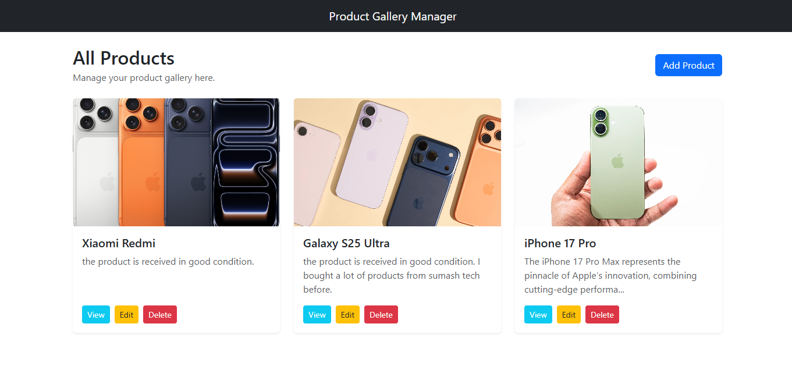
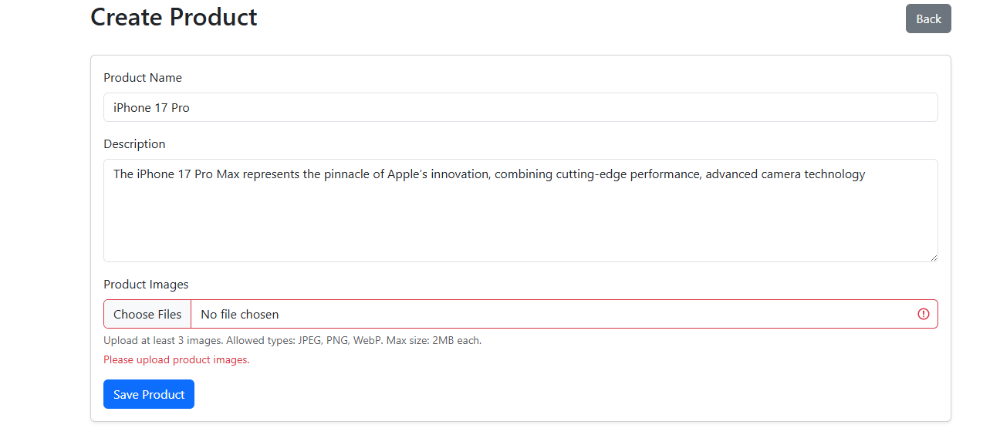
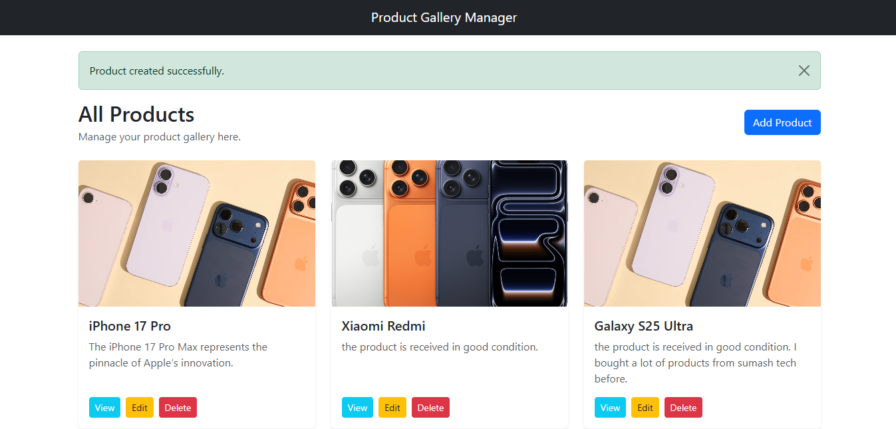
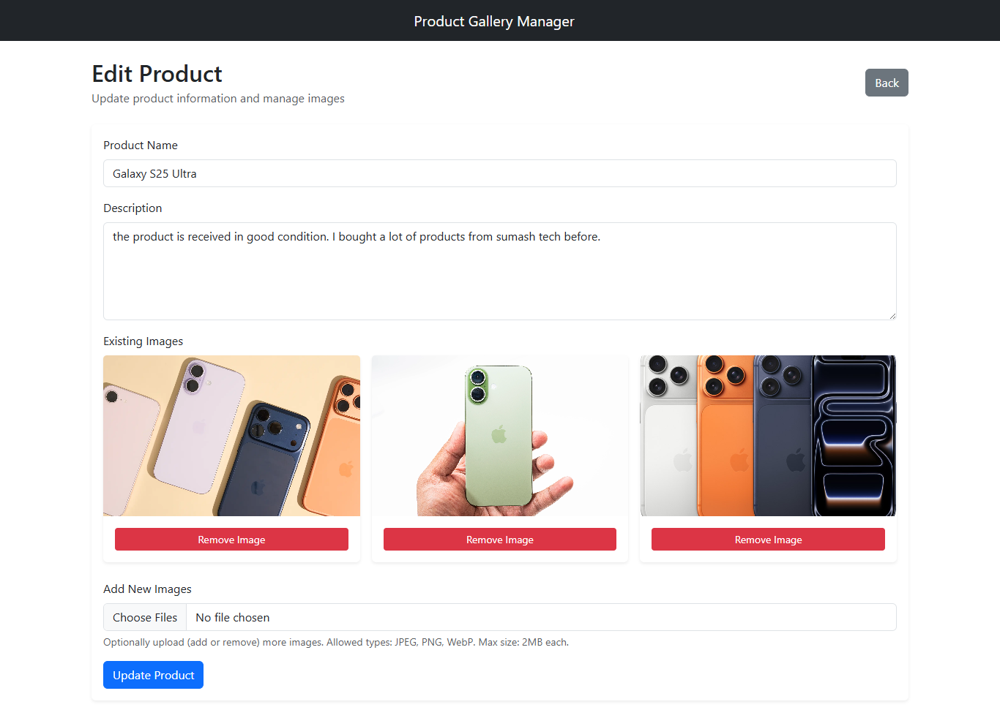

# Product Gallery Manager
This project is a simple Laravel 12 application built as part of a technical assessment.

## Features
- Add a product with:
  - Name
  - Description
  - Multiple images (minimum 3 images)
- View a product with all its images
- Edit product:
  - Update name and description
  - Add new images
  - Remove existing images
- Delete a product:
  - Removes product from database
  - Deletes all related images from storage

## Technologies Used

- Laravel 12
- Blade Templating
- Bootstrap (for UI)
- Eloquent ORM
- Laravel Storage Facade (For File Handaling)

## Storage

Images are stored in:

storage/app/public/products

To access images publicly:

php artisan storage:link

## Validation

- Name and Description are required
- Images must be:
  - JPEG / PNG / WebP
  - Maximum size: 2MB

## Database Setup

Run the following commands:

- Database setup:
  - Run composer install
  - Run cp .env.example .env
  - Run php artisan key:generate
  - Set database config in .env:
    - DB_CONNECTION=mysql
    - DB_HOST=127.0.0.1
    - DB_PORT=3306
    - DB_DATABASE=your_db_name
    - DB_USERNAME=root
    - DB_PASSWORD=
  - Run php artisan migrate
  - Run php artisan db:seed
  - Run php artisan storage:link
  - Run php artisan serve

# Run migrations & seeders
- php artisan migrate
- php artisan db:seed

# Link storage & run server
- php artisan storage:link
- php artisan serve

## Factory & Seeder (Bonus)

Sample data can be generated using:

php artisan db:seed

This will create sample products with related images.

## Implementation Details

- Used Eloquent relationships (Product hasMany ProductImage)
- Used Laravel Form Request for validation
- Used Storage facade for image upload and deletion
- Used Blade templates for UI rendering
- Clean migration and folder structure maintained

## GitHub Repository

 - https://github.com/skrsabbih/product_gallery_manager.git

## Notes

- Seeded images are sample paths for testing relationships.
- Real images can be uploaded from the application UI.

## Assessment View
### Product List Page

### Create Product Page

### Edit Product Page

